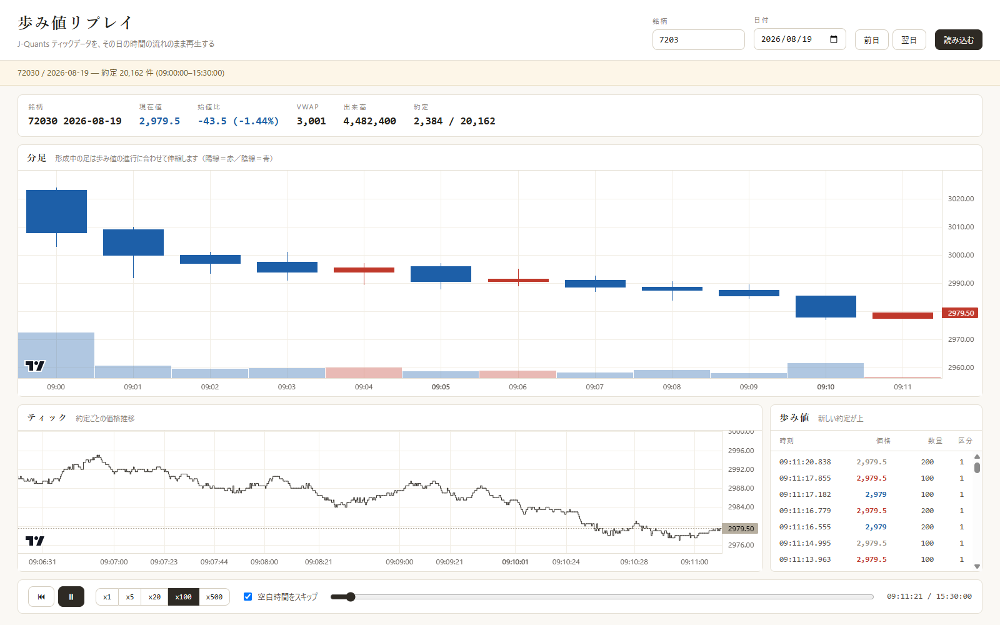

# 歩み値リプレイ

J-Quants のティックデータ（歩み値）を、その日の時間の流れのまま再生する
ローカル Web アプリ。ティックチャート・分足チャート・歩み値テープ・板が
同じ仮想時刻で同時に進む。



## 起動

```bash
uv sync
uv run python run.py
```

既定で <http://127.0.0.1:8765/> を開く。オプション:

| フラグ | 既定 | 意味 |
| --- | --- | --- |
| `--host` | `127.0.0.1` | 待ち受けアドレス |
| `--port` | `8765` | 待ち受けポート |
| `--no-browser` | off | ブラウザを自動で開かない |
| `--reload` | off | 開発用オートリロード |

## リモートホスティング（cloud-run）

`http://backcast.i234.me:8080/` は上と同じ歩み値リプレイの UI をそのまま
公開している。`cloud-run/main.py`（従来は `.duckdb` 配信専用の Flask
ファイルサーバー）を FastAPI に書き換え、`src/tickreplay/server.py` の
アプリを同一プロセス・同一ポートに `/` としてマウントする形で統合した。

- **認証なし**: 個人利用・非公開データではない前提で、UI・API とも認証を
  付けていない（意図的な選択）。
- **ヘルスチェック**: `/` はもう health check ではない（UI に置き換わった）。
  ヘルスチェックは `GET /healthz` に移動した。
- **ダウンロード元の自己参照**: このホストでは `BACKCAST_DUCKDB_SERVER_URL`
  を `http://127.0.0.1:$PORT`（自分自身へのループバック）に、
  `BACKCAST_DUCKDB_CACHE_DIR` を `$STOCKDATA_CACHE_DIR/jp`
  （ファイルサーバー自身が配信している `jp/stocks_trades/...` と同じ場所）
  に、`cloud-run/main.py` がそれぞれ既定値として設定する（実環境変数で
  上書き可能）。後者は下の「既存の `jp` データルートを直接指定した場合」の
  挙動を利用しており、二重ダウンロード・二重保存を避けている。

### デプロイ

イメージは Docker Hub に `backcast/cloud-run` として push し、ホーム
サーバー側で `docker pull` して再起動する運用（この手順自体はリポジトリの
外側・手動）。`main.py` が `src/tickreplay` を import するため、**ビルド
コンテキストがリポジトリ直下に変わった**点に注意（以前は `cloud-run/`
だけをコンテキストにしていた場合、コマンドの変更が必要）:

```bash
docker build -f cloud-run/Dockerfile -t backcast/cloud-run:latest .
docker push backcast/cloud-run:latest
```

その後、ホームサーバー側で `docker pull backcast/cloud-run:latest` して
コンテナを再起動する（この repo の外の作業）。

## データ（DuckDB サーバーキャッシュ）

`.duckdb` はもうローカルに同期済みのディレクトリを直接読まない。自宅サーバー
`http://backcast.i234.me:8080`（`cloud-run/main.py`）から
`stocks_trades/<銘柄>.duckdb` を必要なときにダウンロードし、ローカルの
キャッシュディレクトリの `stocks_trades/` サブディレクトリに保存して読む
（DB は常に read-only で開く）。サーバー側と同じ `stocks_trades/` の階層に
するのは、`BACKCAST_DUCKDB_CACHE_DIR` に既存の `jp` データルート（例:
`S:\jp`）を直接指定したとき、すでにある `jp\stocks_trades\<銘柄>.duckdb` を
キャッシュ済みと認識してダウンロードをスキップできるようにするため。

環境変数は環境変数 → リポジトリ直下 `.env` の順で解決する
（`.env.example` を `.env` にコピーして使う。手元でファイルが作れない場合は
下の「`.env.example` の内容」をそのまま貼り付ければよい）。

| 変数 | 必須 | 既定値 | 意味 |
| --- | --- | --- | --- |
| `BACKCAST_DUCKDB_CACHE_DIR` | ○ | なし | アプリが所有・管理するローカルキャッシュディレクトリ。存在しなければ自動作成する |
| `BACKCAST_DUCKDB_SERVER_URL` | — | `http://backcast.i234.me:8080` | ダウンロード元のファイルサーバー |

未設定または不正な設定（`BACKCAST_DUCKDB_CACHE_DIR` が未設定、
`BACKCAST_DUCKDB_SERVER_URL` が `http://`/`https://` で始まらない、
キャッシュディレクトリの場所がディレクトリ以外で塞がっている等）は
**起動時に即座に失敗する**（fail-fast）。旧バージョンのように「起動はするが
銘柄一覧が空」にはならない。

### 挙動

- **初回アクセス**: 銘柄の `.duckdb` がキャッシュに無ければ、その場でダウンロード
  してからコミットする（後述のコミット手順で原子的に入れ替える）。
- **鮮度チェック**: 同一プロセスの寿命中、銘柄ごとに最初のアクセス時
  **一度だけ** conditional GET（`If-None-Match` / `If-Modified-Since`）で
  再検証する。304 なら何もしない。以降そのプロセスでは再検証しない
  （プロセスを再起動すれば再び一度だけ検証される）。
- **オフライン時の縮退運転**: 再検証がネットワーク到達不能で失敗しても、
  既存のローカルファイルがあればそれをそのまま使う（`stale-served` 状態、
  画面に警告を出す）。ディスク容量不足やダウンロード内容の破損など
  ローカル側の問題は縮退運転にせず、明示的にエラーにする
  （オフラインと取り違えない）。
- **存在確認**: サーバーの一覧取得に成功した上でその銘柄が無ければ 404。
  一覧取得自体がネットワーク到達不能で失敗し、かつ直前に保存した一覧にも
  ローカルキャッシュにも無ければ「存在するかどうか分からない」503
  （オフラインだからといって 404 にはしない）。
- **ダウンロード中は非同期**: `/api/session` / `/api/symbols/{stem}` は
  ダウンロードが要る場合すぐに `{"pending": true, "operationId": ...}` を
  返し、実際のダウンロードはバックグラウンドで進む。フロントエンドは
  `/api/status?stem=` をポーリングして完了を待ち、完了したら同じリクエストを
  やり直す。進捗と縮退運転の警告は画面上部のステータスバーに出る。

### キャッシュディレクトリのライフサイクル

- v1 では自動削除・自動縮小を行わない。ディスク容量の上限チェックも無い。
  容量が心配な場合は運用者が手動で監視・削除すること
  （プロセス停止中に `BACKCAST_DUCKDB_CACHE_DIR` を空にして構わない —
  次回起動時に必要な分だけ再ダウンロードされる）。
- **レジューム（再開）は行わない**。ダウンロードが失敗・中断した場合は
  必ず先頭からやり直す。中断した `*.duckdb.part` は次回起動時に無条件で
  破棄する。

### 単一プロセス前提・転送の真正性

- 同じキャッシュディレクトリへの複数プロセスからの同時書き込みは
  想定・保護していない（v1 は 1 マシン = 1 プロセスの前提）。
- 転送は平文 HTTP。SHA-256 検証は**破損検知のみ**で、内容の真正性
  （改ざんされていないことの証明）までは保証しない。署名付きマニフェスト等の
  真正性対策は意図的に見送っている。

分足は **歩み値から逐次集計**している（`stocks_minute` は読まない）。
そのため再生中の「形成中の足」がティックの進行に合わせて正しく伸縮する。

データ側の性質に対応済みの点:

- 1 ファイルに複数の `Code` が混ざることがあるため（例: `3823.duckdb` は
  `38230` 50.8 万行と `3823` 2 行）、`stocks_board_metadata` の
  `record_count` が最大の行を正銘柄とみなす。ファイル名からは決めない。
- `*_Conflict.duckdb`（同期の衝突ファイル）は銘柄一覧から除外する。
- `Timestamp` は文字列なので `TRY_CAST` し、変換できない行と価格 NULL の行は捨てる。
- 同一マイクロ秒の約定は捨てずに 1 マイクロ秒ずつ後ろへずらす
  （Lightweight Charts が単調増加の時間軸を要求するため）。
- `Type`（`'1'` / `'2'` など）に売買の意味づけはしていない。テープには
  生の値をそのまま出し、色は前約定比の up/down で塗る。
- 保存時刻はタイムゾーンなしの naive 値。これを UTC とみなして epoch 化し、
  Lightweight Charts に UTC のまま描かせるので、**保存された壁時計時刻が
  そのまま軸に出る**。タイムゾーンの読み替えは行っていない。

## 操作

| 操作 | 効果 |
| --- | --- |
| 銘柄 / 日付 → 読み込む | その日のセッションを読み込む。データが無い日は直近の過去営業日に寄せる |
| 前日 / 翌日 | データのある前後の営業日へ移動 |
| ▶ / ⏸（Space キー） | 再生・一時停止 |
| ⏮ | 寄り付き前に巻き戻す |
| x1〜x500 | 再生速度（x1 が実時間） |
| 空白時間をスキップ | 5 秒以上約定が無い区間を飛ばす（昼休みなど） |
| スクラバー | 任意の時刻へシーク。状態を作り直すので前後どちらへでも飛べる |
| 板固定 | チェック中は板の価格列を動かさない。外すと現在値が常に中央に来る |
| 中央へ | 板を張り直して現在値を中央に戻す |

## チャートの配色

国内証券のリアルタイムチャートに合わせている。

- 始値 ≦ 最新値 → **陽線（赤）**
- 始値 > 最新値 → **陰線（青）**

形成中の足は始値が固定され、高値・安値・終値が約定のたびに伸縮し、
上の規則で色が反転する。バーごとに色を明示指定しているので、
ライブラリ既定の up/down 判定には依存しない。

## 板（右カラム）

画面右の板は **板固定（呼値固定モード）**。価格の列は動かさず、現在値の方が
板の中を上下する。狙った価格の位置が動かないので、値動きを板の上で追える。

歩み値には板情報（各価格の注文数量）が無いので、数量は演出として作っている。
実データは価格と約定だけで、板の中身は次の規則で生成した見せかけである。

- **数量**: 現在値の上下 10 行だけ、かわいい記号（🍌🍑🍓…）を 1〜4 個ランダムに
  並べる。それより外は空白（証券会社のトレードソフトと同じ見え方）。
  一度決めた行はその価格で約定するまで変えない。
- **スプレッド**: 最良買と最良売の間に空ける呼値の数を 0 / 1 / 2 から引く。
  確率は 0 > 1 > 2。直近約定が上昇なら現在値＝最良売、下降なら現在値＝最良買。
- **約定**: 約定した価格の行が一瞬光る。高速再生では 1 フレームあたり直近
  6 件までに絞る。
- **呼値**: データに呼値の情報が無いため、その日の価格差の最小値から
  0.1 / 0.5 / 1 / 5 … の候補のうち最も近いものを推定して使う。

板固定でも、現在値が板（41 行）の外へ出たときと、シークしたときは張り直す。

売気配は青、買気配は赤で塗る（国内証券の板の慣行）。

## 構成

```
run.py                         起動スクリプト（uvicorn）
src/tickreplay/
  config.py                    サーバーキャッシュ設定の解決 + HTTP クライアント構築
  cache.py                     ダウンロードのステージング（検証済み .part を作る）
  cache_commit.py              .part を live ファイルへ原子的にコミットする調停役
  repository.py                サーバーキャッシュ経由の read-only アクセス
  server.py                    FastAPI（lifespan・API・静的配信・操作トラッカー）
  static/
    index.html / styles.css    UI（itayomikun.com 参考のライトテーマ）
    app.js                     再生エンジン・チャート・テープ・板
    request-coordinator.mjs    フロントエンドのリクエスト調停・ポーリング
    vendor/                    lightweight-charts v4.2.0（同梱・CDN 不要）
cloud-run/
  main.py                      ダウンロード元のファイルサーバー（Flask）
```

再生はすべてブラウザ内で行う。サーバは 1 セッション分の約定を列指向 JSON
（`us` / `price` / `qty` / `type`）で一括返すだけなので、シークも速度変更も
サーバ往復なしで即座に効く（初回ダウンロードを除く）。転送は gzip 圧縮している。

実測（この環境、ローカルキャッシュ済み）: 7203 の 1 日 = 20,162 約定で約 0.8 秒 /
650 KB、9984 の 1 日 = 104,054 約定で約 1.8 秒。

## API

| エンドポイント | 内容 |
| --- | --- |
| `GET /api/status?stem=` | その銘柄のダウンロード進捗のスナップショット（`serverEpoch` / `operationId` / `revision` / `state` / `bytesReceived` / `totalBytes` / `error`）。リポジトリ構築・ネットワーク I/O・ディレクトリ走査を一切行わない純粋な in-memory スナップショットで、頻繁にポーリングしてよい |
| `GET /api/symbols?q=&limit=` | 銘柄ファイル一覧（前方一致） |
| `GET /api/symbols/{stem}` | 正銘柄コードとデータ期間。ダウンロードが必要なら `{"pending": true, "operationId": ..., "serverEpoch": ...}` を返す |
| `GET /api/session?stem=&date=&direction=` | 1 日分の約定（列指向）。`direction` は `0`=その日のみ / `-1`=過去方向 / `1`=未来方向。ダウンロードが必要なら `{"pending": true, ...}` を返す |

`pending: true` を受け取ったら `/api/status?stem=` を `state` が
`fresh` / `stale-served`（成功・縮退運転で終了）または `corrupt`（失敗）に
なるまでポーリングし、元のリクエストをやり直す
（`src/tickreplay/static/request-coordinator.mjs` が実装している）。

## テスト

```bash
uv run pytest tests/test_tickreplay_config.py tests/test_tickreplay_cache.py \
  tests/test_tickreplay_cache_commit.py tests/test_tickreplay_repository.py \
  tests/test_tickreplay_server.py tests/test_cloud_run_main.py
node --test src/tickreplay/static/*.test.mjs
```

本番データには触れず、同じ構造の一時 DuckDB とモック HTTP トランスポート
（`httpx.MockTransport`）で検証する。フロントエンドのリクエスト調停・
競合状態のガードは `request-coordinator.test.mjs` で Node の組み込み
テストランナーを使って検証する。

## 旧バージョンからの移行（カットオーバー）

このバージョンから `BACKCAST_JQUANTS_DUCKDB_ROOT`（ローカルに同期済みの
ディレクトリを直接読む方式）は完全に廃止されている。読まれなくなるだけで
なく、新しい `BACKCAST_DUCKDB_CACHE_DIR` が無いと**アプリの起動自体が
失敗する**（fail-fast）。アップグレード前に `.env`（またはプロセス環境変数）
を以下のように書き換えること。

1. `BACKCAST_JQUANTS_DUCKDB_ROOT` の値を控えておく（ロールバック用に、
   カナリア期間が終わるまで捨てない）。
2. `.env.example`（下記「`.env.example` の内容」参照）を元に
   `BACKCAST_DUCKDB_CACHE_DIR` を新規に設定する。既存の
   `BACKCAST_JQUANTS_DUCKDB_ROOT` のディレクトリとは別の場所にすること
   （前者はアプリが所有・書き込みするキャッシュ、後者は読み取り専用の
   同期先で性質が違う）。
3. 新しいリリースを起動する。起動できれば設定は正しい。

### ロールバック手順

カットオーバーの前後で手順が変わる（サーバー側とクライアント側の
ロールバックが独立かどうかが変わるため）。

- **クライアントが新版に切り替わる前（サーバーのみデプロイ済みの段階）**:
  サーバー側（`cloud-run` イメージ）のロールバックは完全に独立して行える。
  一覧エンドポイントは追加のみで、まだ何もそれに依存していない。
- **クライアントが新版に切り替わった後**: クライアントはもうローカル root
  を読む経路を持たないため、サーバーだけを戻しても直らない。
  **クライアントを先に**ロールバックすること：
  1. その端末の `.env` を、控えておいた
     `BACKCAST_JQUANTS_DUCKDB_ROOT`（有効なローカル root を指す値）に戻す。
  2. その状態で旧リリースのプロセスを起動する（新しいカットオーバー後の
     設定のまま旧リリースを一瞬でも起動しない — 起動前に `.env` を戻す
     順序を守る）。
  3. クライアントのロールバックと**同時か、その後に**サーバーもロール
     バックする。カットオーバー後はサーバーだけを戻す運用は成立しない。
- **カナリア**: 1 台・1 銘柄で新規ダウンロード・キャッシュヒット・強制再
  検証・オフライン縮退運転の 4 パターンを一通り確認してから、控えておいた
  旧 `BACKCAST_JQUANTS_DUCKDB_ROOT` の値を破棄すること。

## `.env.example` の内容

このサンドボックス環境では `.env` 系ファイル名への書き込みが権限で
ブロックされているため、リポジトリ直下に `.env.example` は生成できて
いない。以下の内容をコピーして手元で `.env.example`（または直接
`.env`）として保存すること。

```bash
# Backcast tick-replay app — environment configuration.
#
# Copy this file to `.env` (repo root) and fill in the values, or set the
# same names as real process environment variables — the process
# environment always wins over `.env` when both are set.

# Required. A local directory the app owns and manages as its download
# cache — created automatically if missing. Safe to delete entirely between
# runs; the app just redownloads what it needs.
BACKCAST_DUCKDB_CACHE_DIR=S:/jp

# Optional. The file server the cache downloads from. Defaults to the
# production server (http://backcast.i234.me:8080) if unset.
# BACKCAST_DUCKDB_SERVER_URL=http://backcast.i234.me:8080

# Removed (pre-cutover) — no longer read by any code path. Safe to delete;
# kept here only so an old .env is easy to diff against this one.
# BACKCAST_JQUANTS_DUCKDB_ROOT=S:/jp
```
